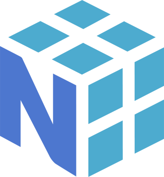

# Hi there, I'm Brijesh! 👋

- Email - ahbrijesh2004@gmail.com
- LinkedIn - www.linkedin.com/in/brijeshah
- Mobile No - +91 (6384665931)

## 💻 Tech Stack
<table align="center">
  <tr>
    <td align="center"></td>
    <td align="center"></td>
    <td align="center"></td>
  </tr>
  <tr>
    <td align="center"></td>
    <td align="center"></td>
    <td align="center"></td>
  </tr>
  <tr>
    <td align="center"></td>
    <td align="center"></td>
    <td align="center"></td>
  </tr>
  <tr>
    <td align="center"></td>
    <td align="center"></td>
  </tr>
</table>

Feel free to reach out for collaboration or further information! 📫
